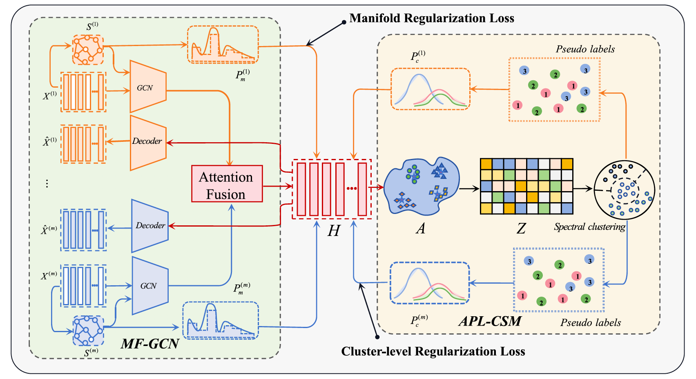

# Anchor graph-guided dual-target alignment network for incomplete multi-view clustering

## Abstract
Deep learning has shown good performance in handling incomplete multi-view clustering tasks. However, existing
deep clustering methods face challenges such as noise interference introduced by completion, insufficient
information fusion, and task decoupling when dealing with high missing rates and multi-view data, limiting clustering
performance. To address these issues, this paper proposes an Anchor Graph-guided Dual-target Alignment
Network for Incomplete Multi-View Clustering (AGDAN). We design a GCN-attention collaborative encoder to
extract view-specific features through GCN and achieve implicit completion of missing views through cross-view
attention gating. We also develop a bidirectional manifold-clustering distribution alignment mechanism, where
the forward alignment stage enforces geometric consistency of the manifold structure via KL divergence, and the
backward alignment stage utilizes anchor graphs and spectral clustering to optimize the global clustering target
distribution. Extensive experimental results show that our method performs excellently even with high missing
rates and demonstrates strong adaptability in large-scale clustering tasks.

## Citation

>Ao Li, Xinya Xu, Tianyu Gao, Dehua Miao, Fengwei Gu, Xinwang Liu. Anchor Graph-guided Dual-target Alignment Network for Incomplete Multi-View Clustering.Information Fusion, 2025: 104011.
